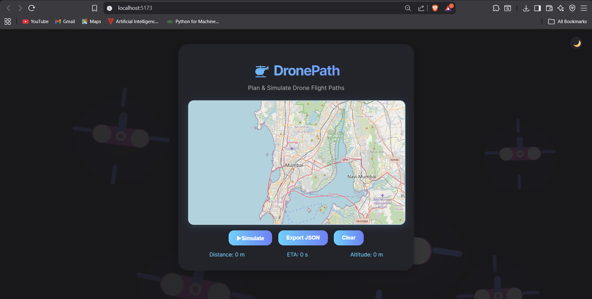

# Drone Path

Drone Path is a web application that allows users to plan and simulate drone flight paths using a map interface. It provides a user-friendly interface for creating and visualizing drone flight paths, with features such as:

- Interactive map for path planning
- Real-time path simulation
- JSON export of flight paths
- Dark mode theme
- Responsive design
- Easy-to-use interface

## Features

- Interactive map for path planning
- Real-time path simulation
- JSON export of flight paths
- Dark mode theme
- Responsive design
- Easy-to-use interface

## Technologies Used

- React
- Vite
- Leaflet
- HTML
- CSS
- JavaScript